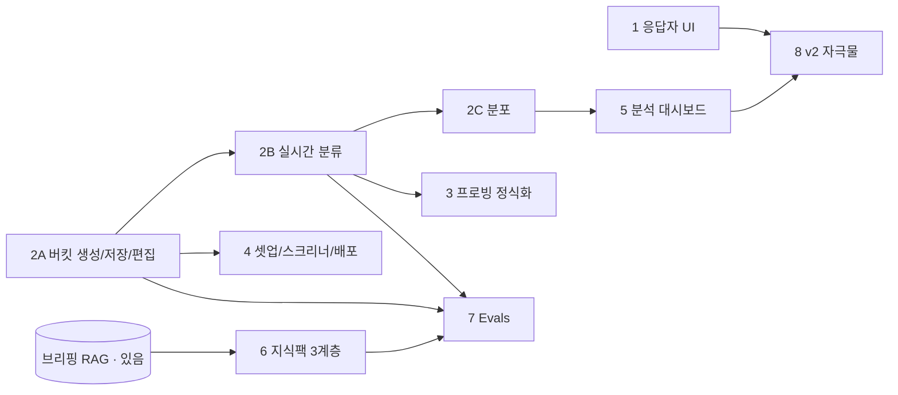

# mindlens × AI-Moderated-Interview-PRD — 통합 로드맵

> **목적:** PRD(`AI-Moderated-Interview-PRD.md`, 웹기준 v1.0)를 현재 mindlens에 얹는 **순서**를 미리 못박는다. 각 Phase는 자체 spec → plan → 실행 사이클을 별도로 돈다. 상세 구현 계획은 Phase별 개별 문서.
> **작성:** 2026-07-22 · **기준 브랜치:** `main`

---

## 0. 출발점 — mindlens는 이미 이 제품의 초기 버전이다

| PRD 개념 | mindlens 현재 | 상태 |
|---|---|---|
| 가이드 자동 생성 (F2) | `prompts/guide.py` (질문+goal) | 있음, **버킷 없음** |
| 프로빙/커버리지 (F5.1) | 인터뷰 그래프 `strategize`·원장(ledger)·probe 상한 | 있음, **버킷 확신도 미연동** |
| 배포 (F4) | `POST /deploy` 공개 링크 | 있음, 스크리너·쿼터·부정탐지 없음 |
| 분석 (F6) | `build_insight` (sentiment·mention **DB 실측**) | 있음, 질문-컬럼 그리드·버킷분포 없음 |
| 지식 배경 (F1.5) | 브리핑 RAG (`briefing_chunks`, 임베딩) | 있음, **3계층 권한·pin·leak-gate 없음** |
| 참가자 UI (F5.3) | 응답자 화면 (Phase 1에서 리디자인 중) | 리디자인 진행 중 |
| PII (7.3) | `services/pii.py` 결정론적 마스킹 | 있음 |

### 전략 노트 — mindlens는 PRD를 그대로 따르지 않는다 (음성 유지)

PRD v1은 **텍스트 전용**(음성은 v2)이지만, mindlens의 정체성은 **FuriosaAI RNGD NPU 위의 실시간 음성 인터뷰**다. 음성은 버릴 차별점이 아니라 벤치마크의 이유다. 따라서 로드맵은 **PRD의 방법론(버킷·분류·분석·지식팩)을 채택하되, 음성 모달리티는 계속 유지**한다. PRD의 "text-only v1"은 Outset의 경로이고, mindlens는 그 위에 음성을 얹은 상위집합으로 간다.

---

## 1. Phase 순서 (의존성 순)

| # | Phase | PRD | mindlens 델타 | 의존 | 규모 | 이 Phase가 출시하는 것 |
|---|---|---|---|---|---|---|
| **1** | 응답자 UI 리디자인 *(진행 중)* | F5.3 | 아바타 제거·센터 컬럼(모바일 우선/데스크톱 중앙)·자극물 UI 예약·진행률 | — | S | 새 참가자 인터뷰 화면 |
| **2A** | **버킷: 생성+저장+편집기** | F2.1/F2.3 | `guide.py` 스키마에 `response_buckets` 추가(MECE·정의·캐치올·부정케이스), `GuideRow.questions` JSONB에 중첩, 대시보드 편집기 | 1 무관 | M | 리서처가 버킷 있는 가이드를 본다 |
| **2B** | 버킷: 실시간 분류 | F6.1/F6.4 | 답변→버킷 배정+확신도+근거스팬. `reflect_ledger`/`build_insight` 확장, 배정 저장 | 2A | M | 세션 종료 시 버킷 배정 완료 |
| **2C** | 버킷: 분포 표시 | F6.3 | 질문별 버킷 분포 — **N수는 DB 실측**(계약 1) | 2B | S | 대시보드에 버킷 분포 |
| **3** | 프로빙 엔진 정식화 | F5.1/F3.1 | 버킷 확신도(<0.6/격차<0.15)·must_capture로 프로빙 구동, 프로빙 유형 5종, 피로 감지 | 2B | M | 더 깊은 프로빙, off-guide 0 |
| **4** | 스터디 셋업·스크리너·배포 | F1/F1.2/F3.2-3/F4 | 리서치유형·목표시간·목표N 필드+유형별 생성분기, 스킵로직, 페르소나 편집, 스크리너, 쿼터, 부정응답탐지 | 2A | L | 실운영 가능한 스터디 셋업 |
| **5** | 분석 대시보드 완성 | F6.2/F6.3/F6.5 | 질문-컬럼 그리드(반응형 3단계), 근거스팬 hover, Chat with data, CSV/PPTX Export, 수동 버킷 교정 | 2C | L | 리서처 분석 워크플로 완성 |
| **6** | 지식 팩 3계층 | F1.5 | 브리핑 RAG를 pin·읽기전용·**발화금지**·blocklist로 승격, **leak-rate 0% 게이트** | 브리핑 RAG(있음) | L | 안전한 배경지식 주입 |
| **7** | 품질 Evals (CI) | F8 | 가이드/프로빙/분류/팩 품질 지표를 CI에서 상시 측정 | 2A·2B·6 | M | 회귀 방지 게이트 (상시) |
| **8** | v2 확장 | §10 v2.0 | **자극물 데이터 연동**(Phase 1이 UI 예약해둠), 다국어. *음성은 이미 있음* | 1·5 | L | 컨셉테스트·글로벌 |

*규모: S(1~2일)·M(3~5일)·L(1주+). 대략치.*

## 2. 의존성 그래프

**임계 경로:** 1 → 2A → 2B → (2C → 5) ‖ 3. 나머지(4·6·7)는 2A 이후 병렬 착수 가능.

## 3. 마일스톤 (PRD §10 대응)

- **MVP** = Phase 1 + 2A + 2B + 2C + 3 + 4(스크리너까지). "가이드(버킷 포함) → 인터뷰(프로빙) → 분석(버킷분포)"의 한 줄이 서는 지점.
- **v1.0** = + Phase 5(분석 완성) + Phase 6(지식팩) + Phase 7(evals).
- **v2** = Phase 8.

## 4. 미결 결정 (진행 중 확정)

1. **음성 유지 범위** — Phase 2~5 동안 음성 인터뷰를 계속 1급으로 둘지, 텍스트를 기본으로 하고 음성을 옵션으로 둘지. (권장: 음성 유지 — NPU 벤치마크의 근거)
2. **버킷 저장** — JSONB 중첩(권장, 마이그레이션 없음) vs 별도 테이블. (2A에서 확정)
3. **참가자 폭 기준** — PRD §5.3 "모바일 우선(320px)"으로 최종 고정. Phase 1 QA에서 320px 우선 확인.
4. **지식팩 vs 브리핑 RAG** — Phase 6에서 기존 브리핑을 승격할지, 병존할지.

---

*다음 상세 계획: `2026-07-22-response-buckets-2A.md` (Phase 2A).*
